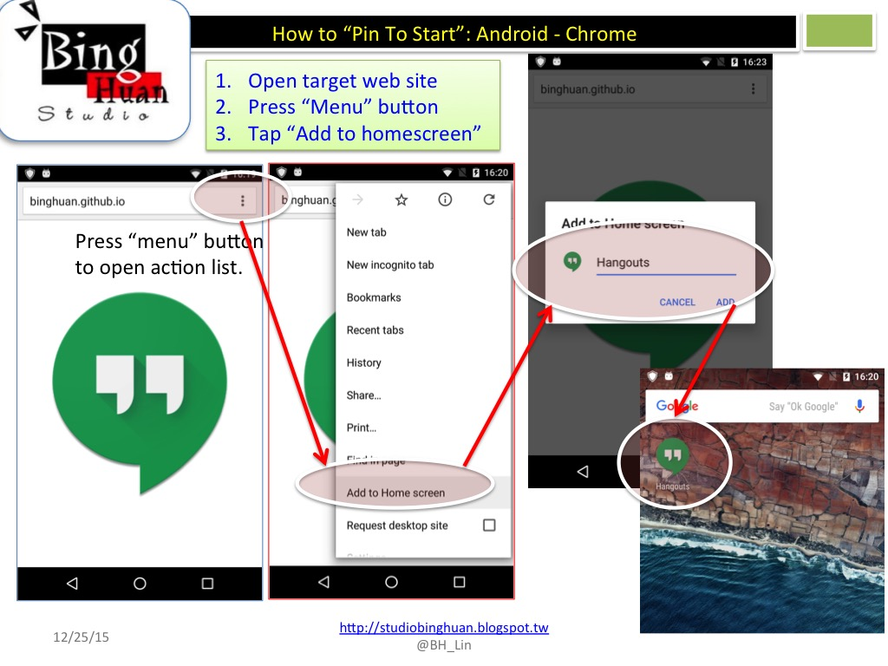

# Hangouts Web Shortcut

A Progressive Web App (PWA) that provides a convenient shortcut to Google Hangouts. When accessed, it displays a centered Hangouts icon that directly opens the Hangouts app from the Google Play Store.

## Features

- **Progressive Web App**: Can be added to your device's home screen for quick access
- **Cross-platform icons**: Supports multiple icon sizes for different devices and platforms
- **Mobile optimized**: Responsive design with viewport optimization for mobile devices
- **Apple Touch Icon support**: Optimized for iOS devices with various icon sizes
- **Context menu disabled**: Clean user experience without right-click menu

## How It Works

1. The web page displays a centered Hangouts icon (320x320 pixels)
2. Clicking the icon opens the Google Play Store link for Hangouts (`com.google.android.talk`)
3. The page includes meta tags for PWA functionality and mobile optimization

## Installation

### Android Devices
To add Hangouts to your home screen on Android device:

**Option 1: Scan QR Code**
<br>You can just scan the following QR Code and pin to start


**Option 2: Direct Link**
<br>Or, visit the link directly: <a href="http://binghuan.github.io/hangouts">http://binghuan.github.io/hangouts</a>



### iOS Devices
1. Open the link in Safari
2. Tap the Share button
3. Select "Add to Home Screen"
4. The app will use the appropriate touch icon for your device

## Technical Details

### Supported Icon Sizes
- **Favicon**: 16x16, 32x32, 64x64
- **Android**: 128x128, 192x192, 196x196, 512x512
- **iOS Touch Icons**: 64x64, 76x76, 120x120, 152x152
- **Windows**: 144x144, 256x256, 1024x1024

### Meta Tags
- Viewport optimized for mobile devices
- Apple mobile web app capable
- Black status bar style for iOS

## Files Structure

```
hangouts/
├── index.html              # Main web page
├── icons/                  # Icon files in various sizes
│   ├── Icon.png           # Main icon (used in webpage)
│   ├── icon.ico           # Favicon
│   └── Icon-[size].png    # Various sized icons
├── images/                # UI images
└── pictures/              # Documentation images
    ├── QRCode.jpg         # QR code for quick access
    └── pin_to_start.jpg   # Installation guide image
```

## Live Demo

Visit: [http://binghuan.github.io/hangouts](http://binghuan.github.io/hangouts)
